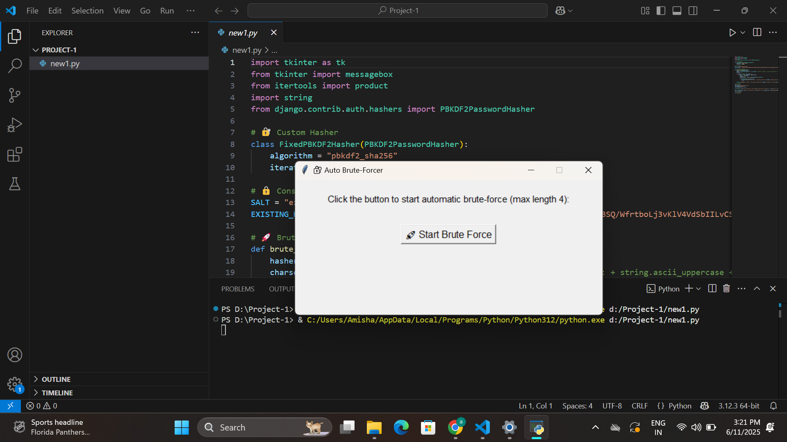
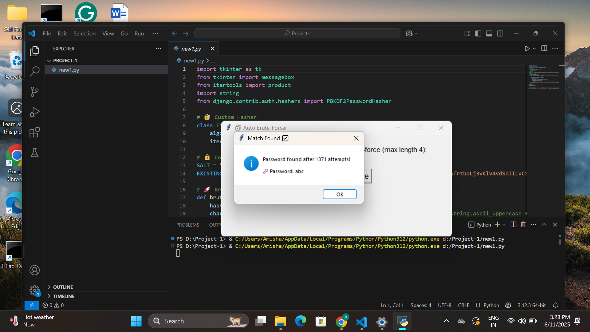

# AutoHashCracker

A simple GUI-based brute-force password cracker built using Python and Tkinter. This tool demonstrates how a brute-force attack can be launched against passwords hashed with Django's PBKDF2-SHA256 algorithm. For educational purposes only.

---

## Project Overview

This project creates a GUI that simulates an **automatic brute-force attack** on a PBKDF2-hashed password with a known salt. The goal is to demonstrate the vulnerability of short or weak passwords against brute-force techniques.


> *Figure: Start screen with the brute-force button*

After pressing "Start Brute Force", the program begins attempting combinations of alphanumeric characters (A-Z, a-z, 0-9) of up to 4 characters in length. Once the correct password is found, a success message is displayed.


> *Figure: Brute-force successful — password "abc" found after 1371 attempts*

---

## Features

- GUI-based using `tkinter`
- Uses `PBKDF2PasswordHasher` from Django
- Brute-forces a password from an existing PBKDF2 hash
- Tries all combinations of characters (a-z, A-Z, 0-9) up to length 4
- Shows attempt count when a match is found

---

## How It Works

1. **Hash Setup**: 
   - The password hash and salt are predefined using Django's PBKDF2 algorithm.
2. **Brute Force**: 
   - The script tries all possible combinations (max length = 4) of alphanumeric characters.
   - Uses `itertools.product()` to generate combinations.
3. **GUI Interaction**: 
   - A user clicks a button to start brute force.
   - If a match is found, a popup shows the found password and number of attempts.

---

## Getting Started

### Prerequisites

Ensure Python 3.10+ is installed along with the following packages:

```bash
pip install django
```

### Running the Project

Clone the repository:
```bash
git clone https://github.com/yourusername/auto-brute-forcer.git
cd auto-brute-forcer
```
Run the script:
```bash
python new1.py
```

Disclaimer
This project is strictly for educational purposes.
Do NOT use this code for any unauthorized access or malicious activities. The intent is to understand brute-force risks and reinforce why secure, long passwords are necessary.


## Author
Amisha Chaware

CDAC Cybersecurity Student

Aspiring Cybersecurity Professional
